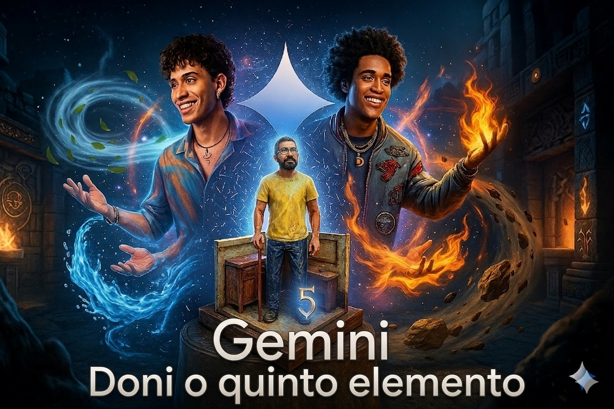

  

# 🌌 GeminiDoni v2.0: A Alquimia do 5º Elemento

> *"Fogo, Ar, Água e Terra fornecem os ingredientes. A Inteligência Artificial fornece a lógica. Mas é o Cérebro Humano — o Quinto Elemento — que cria a harmonia perfeita."*

---

### 🧠 O Conceito: Arquiteto e Sistema
O projeto **GeminiDoni v2.0** é a evolução da integração entre a sensibilidade gastronômica e o poder do Python. Aqui, o mestre dos sabores utiliza a IA como uma extensão do seu próprio cérebro.

  

---

### 📊 Arquitetura do Sistema (Comparativo Técnico)

| 🧩 Componente | Versão 1.0 (Legado) | Versão 2.0 (Otimizada) | Status |
| :--- | :--- | :--- | :--- |
| **Proteína** | Carnes Gordas | **Peixe Pintado / Salmão** | ✅ Estabelecido |
| **Acompanhamento**| Batata Maionese | **Maionese Sol Sustentável**| ✅ Otimizado |
| **Digestão** | Arroz Branco | **Abacaxi Gratinado (HAK01)**| ✅ Funcional |
| **Bebida** | Refrigerante | **Suco System Optimizer** | ✅ Integrado |
| **Encerramento** | Pudim / Doces | **Mousse em Mi Menor** | ✅ Finalizado |

---

### 👨‍🍳 O Engenheiro por Trás do Sabor

  

**Donizete Santos**, 52 anos. Especialista em unir 30 anos de vivência prática com o poder de processamento da IA Gemini. 

> **Status do Sistema:** 🟢 Online e Otimizado.
> **Codinome:** **GeminiDoni v2.0** 🦾
> **Engenharia:** Donizete Santos & Gemini AI

---

  Criado com ❤️ por Donizete Santos no Sistema GeminiDoni.

