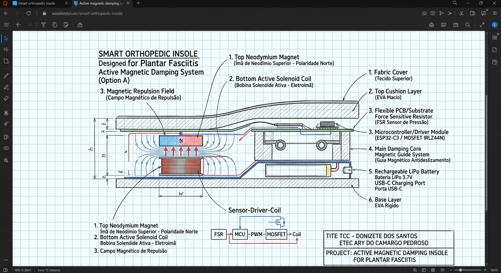

# 
⚡ PROJETO 5 ELEMENTO — GEMINIDONI ⚡

  
  
  

---

> [!IMPORTANT]
  
> *"Portanto, quer comais, quer bebais, ou façais outra qualquer coisa, fazei tudo para a glória de Deus."* — **1 Coríntios 10:31**

---

### 👟 IDENTIDADE VISUAL & ENGENHARIA

  

*🔥 A fusão entre bioengenharia, eletrônica e algoritmos para otimização do movimento humano. 🔥*

---

> [!NOTE]
> 🎯 **OBJETIVO PRINCIPAL DO SISTEMA**  
> Transformação física e saúde sustentável através da disciplina diária, alquimia alimentar e monitoramento de dados biométricos.
> * 📉 **Meta:** Perda de 37,0 kg sem procedimentos cirúrgicos ou remédios caros.
> * 📸 **Registro de Progresso:** Documentação visual (Antes / Depois) e acompanhamento contínuo.
> * 👣 **Monitoramento Inteligente:** Análise de déficit calórico em tempo real via palmilha e scripts Python.

---

## 👤 PERFIL BIOMÉTRICO FIXO (DONIZETE)

| 📐 Parâmetro | 📊 Valor Registrado | 💡 Observação |
| :--- | :--- | :--- |
| **Peso Inicial** | `131,95 kg` | Ponto de partida |
| **Altura** | `1,85 m (185 cm)` | Altura fixa |
| **Idade** | `53 anos` | Métrica de cálculo |
| **Sexo** | `Masculino ('M')` | Perfil metabólico |
| **Fórmula TMB** | `Mifflin-St Jeor` | Motor de cálculo base |

---

## 🧪 OS 5 ELEMENTOS DA ALQUIMIA ALIMENTAR

> [!TIP]
> 1. 🔥 **TERMOGÊNESE:** Ativação metabólica e queima contínua de gordura.
> 2. 🧬 **NUTRIÇÃO:** Sinergia de macronutrientes (foco em alta proteína e densidade).
> 3. 💧 **VOLUMIZAÇÃO:** Máxima saciedade pelo volume inteligente de fluidos e fibras.
> 4. 📊 **TECNOLOGIA:** Controle matemático via Pydroid 3 e sensores de passos.
> 5. 🎯 **EXECUÇÃO DISCIPLINADA:** Adesão rigorosa às metas diárias sem negociação.

---

## ⚙️ ARQUITETURA DO REPOSITÓRIO

### 🛠️ Scripts em Python (`.py`)
* 🐍 `calculadora_dia.py` ➔ **Diagnóstico Diário:** Lê passos da palmilha, calcula TMB e mostra o balanço de calorias.
* 🧪 `ALQUIMIA_PYTHON.py` ➔ **Motor Metabólico:** Calcula taxa de saciedade por volume e macronutrientes.

---

### 📖 Guias de Alquimia Alimentar (`.md`)
* 🍍 `HAK01_ABACAXI.md` ➔ Estratégia de digestão otimizada e saciedade rápida.
* ⚡ `HAK02_METABOLISMO.md` ➔ Protocolo de aceleração metabólica.
* 🥤 `SUCO_OPTIMIZER.md` ➔ Otimizador de hidratação e micronutrientes.
* 🍨 `SOBREMESA_MOUSE.md` ➔ Hack doce de saciedade com impacto calórico reduzido.

---

## 💻 COMO EXECUTAR NO PYDROID 3 (ANDROID)

1. 📲 Abra o **Pydroid 3** no celular.
2. 📂 Selecione o arquivo `calculadora_dia.py`.
3. ▶️ Toque no botão amarelo de **Play** para rodar.
4. 🔢 Insira os dados do seu dia e receba o diagnóstico de déficit calórico instantâneo!

---

## 👨‍🍳 Módulo de Inteligência Nutricional & Biodisponibilidade

> *"A culinária profissional combinada com a precisão dos algoritmos: o alimento como combustível limpo e de alta performance metabólica."*

| Chef & Tecnologia | Churrasqueira & Cocção Seca | Sucos & Ativação de Vitamina C | Feijoada & Antinutrientes |
| :---: | :---: | :---: | :---: |

---

## 👨‍🍳 Módulo de Inteligência Nutricional & Biodisponibilidade

> *"A culinária profissional combinada com a precisão dos algoritmos: o alimento como combustível limpo e de alta performance metabólica."*

| Chef & Tecnologia | Churrasqueira & Cocção Seca | Sucos & Ativação de Vitamina C | Feijoada & Antinutrientes |
| :---: | :---: | :---: | :---: |
| Origem da Jornada | Chef & Tecnologia | Churrasqueira & Cocção Seca | Suco & Ativação Vit. C | Feijoada & Antinutrientes |
| :---: | :---: | :---: | :---: | :---: |
|  |  |  |  |  |
| *Ponto de Partida* | *Chef Tecnológico* | *Reação de Maillard* | *Sinergia e Extratos* | *Remolho e Digestividade* |

| *O Chef Tecnológico* | *Reação de Maillard sem excessos* | *Sucos funcionais e extratos* | *Remolho e biodisponibilidade* |

### 🎯 Pilares Nutricionais

* **Ativação de Nutrientes (Biodisponibilidade)**: Parear vegetais verde-escuros com Vitamina C (limão) multiplica a absorção de ferro não-heme. Lipossolúveis (A, D, E, K) necessitam de fonte leve de gorduras boas (azeite/sementes).
* **Saciedade Sem Excesso**: Volume gástrico com vegetais estruturais e fibras (couve-flor, alho-poró) para evitar picos de insulina e prolongar a saciedade.
* **Sabor Sem Excesso**: Uso estratégico de aromáticos (alho-poró, cebola, especiarias) e Reação de Maillard (grelha/air fryer) para extrair o máximo de sabor natural sem sódio ou gordura ruim.

* 🧪 `src/ativacao_nutrientes.py` → **Inteligência Nutricional:** Mapeia regras de ativação, técnicas de cocção (vapor, churrasqueira, air fryer) e aromáticos para máxima absorção e sabor.

| *O Chef Tecnológico* | *Reação de Maillard sem excessos* | *Sucos funcionais e extratos* | *Remolho e biodisponibilidade* |

### 🎯 Pilares Nutricionais

* **Ativação de Nutrientes (Biodisponibilidade)**: Parear vegetais verde-escuros com Vitamina C (limão) multiplica a absorção de ferro não-heme. Lipossolúveis (A, D, E, K) necessitam de fonte leve de gorduras boas (azeite/sementes).
* **Saciedade Sem Excesso**: Volume gástrico com vegetais estruturais e fibras (couve-flor, alho-poró) para evitar picos de insulina e prolongar a saciedade.
* **Sabor Sem Excesso**: Uso estratégico de aromáticos (alho-poró, cebola, especiarias) e Reação de Maillard (grelha/air fryer) para extrair o máximo de sabor natural sem sódio ou gordura ruim.

* 🧪 `src/ativacao_nutrientes.py` → **Inteligência Nutricional:** Mapeia regras de ativação, técnicas de cocção (vapor, churrasqueira, air fryer) e aromáticos para máxima absorção e sabor.
