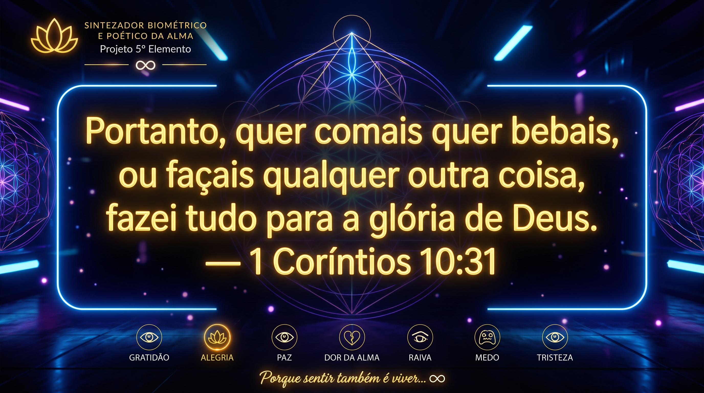
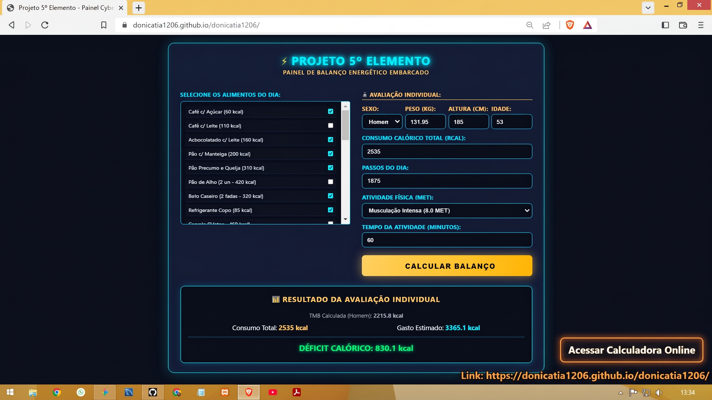

# Donizete dos Santos | Projeto 5º Elemento
*Desenvolvedor, Entusiasta de IoT & Alquimia Tecnológica*

---

## ⚙️ ARQUITETURA DO REPOSITÓRIO

* **Scripts em Python (`.py`):**
  * `calculadora_dia.py` $\rightarrow$ **Diagnóstico Diário:** Painel do padrão celular, déficit calórico e taxa metabólica.
  * `inteligencia_nutricional.py` $\rightarrow$ **Biodisponibilidade:** Mapeamento da absorção de micronutrientes.

* **Guias de Alquimia Alimentar (`.md`):**
  * Estruturas de digestão, performance metabólica e synergy de nutrientes.

---

## 👨‍🍳 MÓDULO DE INTELIGÊNCIA NUTRICIONAL & BIODISPONIBILIDADE

> *"A sabedoria nutricional combinada com a precisão dos algoritmos transforma o alimento em combustível limpo para alta performance."*

### 🍳 Jornada & Visão Tecnológica

| Chef Tecnólogo | Vitamina C & Absorção | Feijoada & Antinutrientes |
| :---: | :---: | :---: |
|  |  |  |

---

## 👟 PALMILHA INTELIGENTE (ESP32-C3 & IoT)

* 🔗 **Simulação Virtual:** [Acessar Projeto Wokwi](https://wokwi.com/)
* 📄 **Relatório Técnico:** [Ver Documentação da Palmilha](https://github.com/donicatia1206/PROJETO_5O_ELEMENTO)
* 🧠 **Visão Científica:** *A fusão entre bioengenharia, eletrônica e algoritmos para otimização do movimento humano.*

---

## 📊 CALCULADORA DE DÉFICIT CALÓRICO & PAINEL

  

👉 **[Clique aqui para acessar o Painel Interativo Online](https://donicatia1206.github.io/donicatia1206/)**

## 💧 SINTETIZADOR BIOMÉTRICO E POÉTICO DA ALMA (PROJETO 5º ELEMENTO)

> *"Lágrimas são a linguagem silenciosa do sistema quando a lógica pura não basta."*

  

| 🌅 Nascer do Sol | 🟡 Gratidão | 🔵 Tristeza | 🔴 Lágrimas de Raiva |
| :---: | :---: | :---: | :---: |
|  |  |  |  |

 

---

**Desenvolvido por Donizete (donigemini)**  
*Porque sentir também é viver... ∞*

