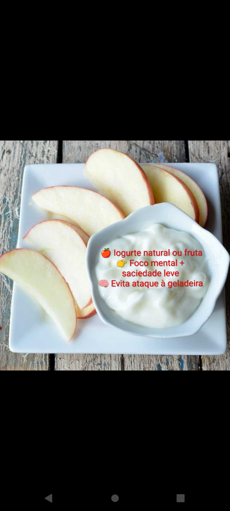
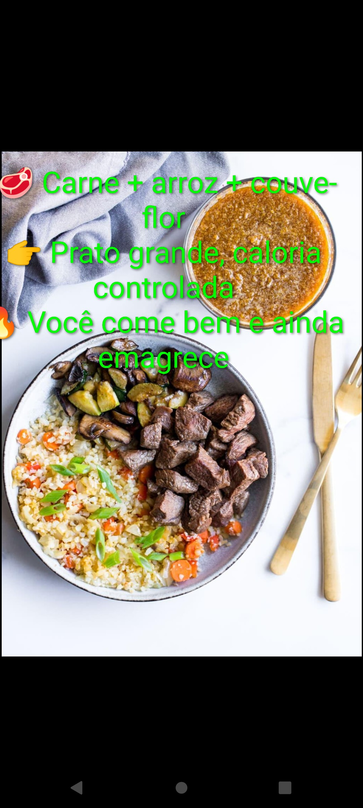
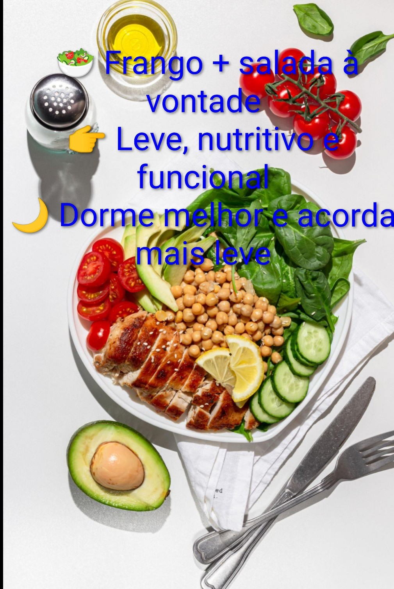

# 🍲 Conforto Terra x Mar: Feijoada Tradicional & Cardápio 5Elemento

> *"A culinária afetuosa e a nutrição funcional podem caminhar lado a lado. Tradição se celebra; a rotina se otimiza."*

---

## 📖 Apresentação

A **Feijoada** é uma das maiores riquezas da nossa gastronomia. Um verdadeiro "Conforto da Terra", rica em sabor, história e afeto, ideal para celebrar momentos especiais ao lado de quem amamos.

O **Cardápio 5Elemento** não nasce para criticar ou substituir o valor cultural da feijoada, mas sim para oferecer uma alternativa de alta digestibilidade ("Conforto Mar & Terra") focada em energia constante, leveza e alta performance para o dia a dia.

---

## ⚖️ Comparativo de Ingredientes & Proposta Nutricional

| Elemento | 🍲 Feijoada Tradicional (Conforto Terra) | 🥗 Cardápio 5Elemento (Mar & Terra) | Proposta de Equilíbrio |
| :--- | :--- | :--- | :--- |
| **Base Proteica** | Feijão preto com carnes nobres e embutidos (costelinha, carne seca, calabresa, paio) | Proteínas magras e variadas (ovos, carnes grelhadas, peixes/frutos do mar, frango) | Preserva o aporte proteico ajustando a densidade de gorduras saturadas. |
| **Acompanhamentos** | Arroz branco, farofa de mandioca e couve refogada no bacon | Arroz de couve-flor, legumes grelhados, saladas folhosas e grão-de-bico | Eleva o volume de fibras e micronutrientes com menor densidade calórica. |
| **Digestão & Finalização** | Laranja em gomos | Laranja ou Abacaxi fresco (rico em bromelina) | Potencializa a quebra de proteínas e garante máximo conforto gástrico. |
| **Frequência Ideal** | Refeição festiva, afetiva e de fim de semana (~1.125 kcal/prato) | Estrutura leve e funcional para a rotina diária (~1.260 kcal/dia completo) | Celebrar com a feijoada nos momentos sociais e aplicar o 5Elemento na rotina diária. |

---

## 📋 Estrutura Diária 5Elemento

### 1. Café da Manhã — Energia Limpa

* **Composição:** 3 ovos + pão integral + café sem açúcar.
* **Benefício 5Elemento:** Sustentação proteica de alto valor biológico para iniciar o dia com saciedade e sem oscilações de energia.

---

### 2. Lanche — Foco & Equilíbrio

* **Composição:** Iogurte natural ou fruta com fibras (ex: maçã).
* **Benefício 5Elemento:** Nutrição estratégica entre refeições para manter o foco mental e evitar exageros nas refeições principais.

---

### 3. Almoço — Volume & Nutrição Controlada

* **Composição:** Grelhado (carne magra ou peixe) + arroz de couve-flor + legumes selecionados.
* **Benefício 5Elemento:** Elevada densidade nutricional e alto volume no prato, proporcionando plena satisfação.

---

### 4. Pós-Almoço — Conforto Digestivo

* **Composição:** Fatias de abacaxi fresco.
* **Benefício 5Elemento:** A bromelina natural atua como enzima digestiva, reduzindo o estufamento e promovendo leveza imediata.

---

### 5. Jantar — Descanso & Reparação

* **Composição:** Frango ou proteína do mar + salada abundante + gorduras boas (abacate/azeite).
* **Benefício 5Elemento:** Refeição leve e funcional que favorece a recuperação noturna e melhora a qualidade do sono.

---

## 💡 Filosofia 5Elemento

> O segredo da consistência não é a restrição, mas o contexto. A feijoada alimenta a alma e celebra a cultura; o Cardápio 5Elemento constrói a saúde e a disposição no dia a dia.
